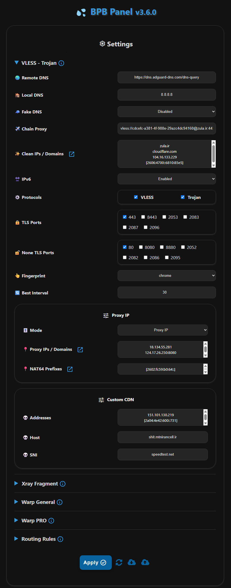

<h1 align="center">中文 BPB</h1>

#### 🌏 Readme in [English](README.md)

<p align="center">
  
</p>
<br>

## 介绍

本项目旨在提供一个用户面板来访问免费、安全和私密的 **VLESS**、**Trojan** 和 **Warp** 配置，确保即使因ISP封锁域名或Warp服务，也能保持连接，提供两种部署选项：

- **工人**部署
- **页面**部署

🌟 If you found **BPB Panel** valuable, Your donations make all the difference 🌟

### USDT (BEP20)

```text
0xbdf15d41C56f861f25b2b11C835bd45dfD5b792F
```

## 功能

1. **免费且私密**: 没有费用，服务器是私有的。
2. **直观面板**: 极简设计，方便导航、配置和使用。
3. **多功能协议**: 提供 VLESS、Trojan 和 Wireguard（Warp）协议。
4. **Warp Pro 配置**: 优化 Warp 适用于关键情况。
5. **碎片支持**: 支持碎片功能，适用于关键网络情况。
6. **全面的路由规则**: 避免伊朗/中国/俄罗斯，阻止 QUIC、色情、广告、恶意软件、钓鱼和制裁。
7. **链式代理**: 能够添加链代理（VLESS、Trojan、Shadowsocks、socks 和 http），以修复 IP。
8. **广泛客户端兼容性**: 提供订阅链接，适用于 Xray、Sing-box 和 Clash-Mihomo 核心客户端。
9. **密码保护面板**: 提供安全且私有的面板，支持密码保护。
10. **完全自定义**: 支持设置清洁域名、代理 IP、DNS 服务器、选择端口和协议、Warp 终点等。

## 限制

1. **UDP 传输**: VLESS 和 Trojan 协议在工人上不正确处理 **UDP**，因此默认禁用（影响 Telegram 视频通话等特性），UDP DNS 也未支持。DoH 默认启用以增强安全性。
2. **请求限制**: 每个工人支持每天 100K 请求（适用于 2-3 个用户）。您可以使用无限的 Warp 配置。

## 开始使用
- [安装方法](https://bia-pain-bache.github.io/BPB-Worker-Panel/installation/wizard/)
- [配置](https://bia-pain-bache.github.io/BPB-Worker-Panel/configuration/)
- [使用方法](https://bia-pain-bache.github.io/BPB-Worker-Panel/usage/)
- [常见问题解答](https://bia-pain-bache.github.io/BPB-Worker-Panel/faq/)

## 支持的客户端

|       Client        |      Version      |  Fragment support  |  Warp Pro support  |
| :-----------------: | :---------------: | :----------------: | :----------------: |
|     **v2rayNG**     | 1.10.26 or higher | :heavy_check_mark: | :heavy_check_mark: |
|     **MahsaNG**     |   14 or higher    | :heavy_check_mark: | :heavy_check_mark: |
|     **v2rayN**      | 7.15.4 or higher  | :heavy_check_mark: | :heavy_check_mark: |
|   **v2rayN-PRO**    |   1.9 or higher   | :heavy_check_mark: | :heavy_check_mark: |
|    **Sing-box**     | 1.12.0 or higher  | :heavy_check_mark: |        :x:         |
|    **Streisand**    | 1.6.64 or higher  | :heavy_check_mark: | :heavy_check_mark: |
|   **Clash Meta**    |                   |        :x:         | :heavy_check_mark: |
| **Clash Verge Rev** |                   |        :x:         | :heavy_check_mark: |
|     **FLClash**     |                   |        :x:         | :heavy_check_mark: |
|   **AmneziaVPN**    |                   |        :x:         | :heavy_check_mark: |
|    **WG Tunnel**    |                   |        :x:         | :heavy_check_mark: |

## 环境变量

|   Variable   |               Usage                |     Mandatory      |
| :----------: | :--------------------------------: | :----------------: |
|   **UUID**   |             VLESS UUID             | :heavy_check_mark: |
| **TR_PASS**  |          Trojan Password           | :heavy_check_mark: |
| **PROXY_IP** | Proxy IP or domain (VLESS, Trojan) |        :x:         |
|  **PREFIX**  |   NAT64 Prefixes (VLESS, Trojan)   |        :x:         |
| **SUB_PATH** |         Subscriptions' URI         |        :x:         |
| **FALLBACK** |  Fallback domain (VLESS, Trojan)   |        :x:         |
| **DOH_URL**  |              Core DOH              |        :x:         |

---

## 项目关注数随时间变化趋势

[](https://starchart.cc/bia-pain-bache/BPB-Worker-Panel)

---

### 特别鸣谢

- VLESS, Trojan [Cloudflare-workers/pages proxy script](https://github.com/yonggekkk/Cloudflare-workers-pages-vless) created by [yonggekkk](https://github.com/yonggekkk)
- CF-vless code author [3Kmfi6HP](https://github.com/3Kmfi6HP/EDtunnel)
- CF preferred IP program author [badafans](https://github.com/badafans/Cloudflare-IP-SpeedTest), [XIU2](https://github.com/XIU2/CloudflareSpeedTest)
